# ZCA/VIC 연구 — 현황 정리 및 다음 한 걸음 (2026-06-26 가지치기)

> 원칙: **한 번에 목표 하나.** 누수 사건 이후 정리한 현 상태. 에이전트가 과확대한 방향(OOD 일반화 필요조건 등)은
> *기록으로만* 남기고 본문 주장에서 제외함. 상세 경위는 [`../실험일지.md`](../실험일지.md) 31·32절.

## 1. 한 줄 현황
비례배분 기여도의 **영-기여 흡수(ZCA)**를 증명·실측했고, **VIC=고정점을 깨는 최소 개입**(저자 의도)으로 확정.
논문 v2([`zca_vic_논문초안_v2.md`](zca_vic_논문초안_v2.md))가 이 축으로 작성됨.
**(2026-06-30 갱신)** ★**pot-스케일 VIC(30번 실험)가 OOD 일반화를 *재현***: CHECK 가상 invest=α%×팟으로
임계를 넘기니, vsRand(OOD)가 off −318(0/6 양) → α35% **+1396(5/5 양, 30~50% plateau)**, vsTAG(ID) 보존.
원래 비재현으로 폐기됐던 OOD 효과를 *누수제거+pot스케일+seed sweep*으로 살림(토이 임계 실증).

## 연구 트리 (한눈에)

> 🔵활성 / ✅완료 / ⏸보류 / ❌폐기.  **활성은 항상 하나**(굵은 파랑 테두리).  보는 법은 문서 끝 §사용법.

```mermaid
flowchart TD
    R["ZCA / VIC 연구"]
    R --> DIAG["✅ ZCA 진단"]
    R --> VIC["✅ VIC = 고정점 깨기"]
    R --> METH["✅ 방법론: 누수 발견·정정"]
    R --> PAPER["✅ 논문 v2 (KCI 별표1)"]
    R --> PARK["보류·폐기 (기록만)"]

    DIAG --> PROOF["✅ toy 증명 (영-고정점·흡수·낙관적초기화 구분)"]
    DIAG --> FAM["✅ 계열 일반화: phi(passive)=0 이면 ZCA"]
    DIAG --> MEAS["✅ 실측 Q(CHECK)=0 (clean 6런)"]
    DIAG --> MULTI["⏸ toy 다단계·확률적 c 확장"]

    VIC --> THR["✅ 임계 ε_min 유도 (toy)"]
    VIC --> POT["✅ 임계 초과 VIC (30번): vs Random 회복 재현"]
    POT --> POTR["✅ off 0/6 → α30% 6/6 · checktime 재현(hindsight 소거)"]
    POT --> E1N["✅ E1 격리: 효과 본체=CHECK credit (누수 의혹 소거)"]
    POT --> E3N["✅ E3 fixed-K{5,20,60}칩 전부 유효 → 상수 ε 임계 실증(Prop 7)"]
    POT --> N1["✅ E4 메커니즘: 턴 CHECK65%→벳65% (수동화 해소)"]
    POT --> N2["✅ E2 홀드아웃: 일반화 기각 (STA −177 유해, 상대 의존 스타일)"]
    POT --> E6N["✅ E6: cycle/mixed 구제 실패 → single-TAG 한정"]
    POT --> E7N["✅ E7 fixed-1 6-seed: 무효(n=1)→전이구간 −117±252 (2/6) 정정"]
    POT --> E8N["✅ E8 경쟁처방 bake-off: 탐색강화·낙관init·일률벌점 전패 → §5.5"]

    PAPER --> V3["✅ 논문 v3.1: 재프레임(검증환경 4사유·Lemma3 본문·전이구간·향후연구) + docx 동기화"]
    PAPER --> SUB["🔵 투고 마감: 통계검정 본문 명기 · 그림 본문 배치 · 저자정보/사사"]
    PAPER --> POS["⏸ 일반 Lemma + RUDDER/null-player 포지셔닝 반영"]

    R --> ROB["강건성 사다리 6단 (35절 사전등록+개정v2, 2026-07-07)"]
    ROB --> L1["⏸ 1단: 카드축 E[HS] K=20 (핵심 20런 + Slumbot 앵커) — 착수 대기"]
    L1 --> L2["⏸ 2단: 행동축 12 (레이즈 8종 + F/X/C/올인)"]
    L2 --> L3["⏸ 3단: 카드축 K=50 (vs TAG) — 해상도-반응 곡선"]
    L3 --> L4["⏸ 4단: CFR+ 구현 (poker-cfrplus/, Kuhn→Leduc→추상HUNL→Slumbot)"]
    L4 --> L5["⏸ 5단: CFR 상대 학습 (K20·A12) — ID+홀드아웃"]
    L5 --> L6["⏸ 6단: K=50 vs CFR — 3단과 교차 대조 (2×2 완성)"]
    L6 -.-> L7["⏸ 이월 카드(사다리 외): SPR 3구간 상태 추가 — 게이트: 천장 진단. 천장 2×2 실측으로 유력해짐"]

    R --> SER["시리즈 (기획)"]
    SER --> S2["⏸ 2편 RTB: 초안 v0(사전등록 골격) — 실험 0"]
    SER --> S3["⏸ 3편 V2G/IoT: MDP 설계서"]
    SER --> S5["⏸ 적응적 임계 ε-적정 카드 (착수조건: 2편 P4 통과 후)"]
    SER --> PROP2["✅ 제안서_연구시리즈 + 읽기목록 + 개념사전"]

    PARK --> X1["❌ fixed-1칩 VIC = OOD 필요조건 (누수+seed 산물)"]
    PARK --> X2["❌ OOD/ID 부호반전 해리 서사"]
    PARK --> X3["⏸ breaker 성능 통제비교"]

    classDef done fill:#d4edda,stroke:#28a745,color:#155724;
    classDef active fill:#cce5ff,stroke:#0066cc,color:#004085,stroke-width:3px;
    classDef idea fill:#fff3cd,stroke:#856404,color:#856404;
    classDef parked fill:#e9ecef,stroke:#868e96,color:#495057;
    classDef dead fill:#f8d7da,stroke:#dc3545,color:#721c24;
    classDef root fill:#cfe2ff,stroke:#084298,color:#084298,stroke-width:2px;

    class R root;
    class DIAG,VIC,METH,PAPER,PROOF,FAM,MEAS,THR,POT,POTR,E1N,E3N,N1,N2,E6N,E7N,E8N,V3,PROP2 done;
    class SUB active;
    class MULTI,POS,X3,PARK,SER,S2,S3,S5,ROB,L1,L2,L3,L4,L5,L6,L7 parked;
    class X1,X2 dead;
```



> **다음 세션 시작점:** 🔵 = 투고 마감 3종(통계검정 본문 명기 · 그림 본문 배치 · 저자정보). 국내 문헌 인용은 해당 없음 확정(저자 판단). 상세: 실험일지 34절.
> **신규 확정(2026-07-07):** 강건성 사다리 **6단**(개정 v2) + 판정 기준 사전등록 — 실험일지 **35절(6)**. 순서: K20 → A12 → K50 → CFR+구현 → CFR학습(K20) → CFR학습(K50) = A12 고정 {K20,K50}×{TAG,CFR} 2×2. **투고 분기는 데이터 축적 후 판단(저자 지시)** — 판정 기준은 측정 규약으로만 유지. 팟 정보(SPR 권장)는 7단 후보로 이월. CFR+ 실험은 `poker-cfrplus/` 별도 폴더.

## 2. 확정된 주장 (저자 의도 — 못박음)
- **VIC의 목표 = 고정점을 *크든 작든 깨는 것 자체*** (Q(CHECK) 0→0.11 실측). OOD 일반화·"필요조건"은 주장 아님.
- **충분한 임계비용(ε > ε_min) 설정은 저자의 후속 과제.** 1칩이 sub-threshold인 건 설계상 당연(팟 400에서 ≈0.25%).

## 3. 확보된 자산 (방어 가능, 파일)
| 자산 | 파일 | 상태 |
|---|---|---|
| ZCA 형식 증명 (영-고정점·흡수·낙관적초기화 구분·VIC 임계) | `toy_zca_proof.md`, `verify_toy_zca.py` | ✅ |
| **계열 일반화** (ZCA ⟺ φ(비용0)=0; return-equivalent 면역) | `verify_toy_family.py` | ✅ 신규 |
| 탈출 메커니즘 비교 (tie-break·잡음 미탈출) | `verify_toy_breakers.py` | ✅ |
| ZCA 실측 (Q(CHECK)=0) + VIC 고정점 깨기 (clean 6런) | `analyze_qcheck.py`, `../results/28_ablation_vic_2m_clean/` | ✅ |
| 누수 발견·정정 (방법론 각주) | `CLEAN_ZERO_INVEST`, `../results/.../mixed_vic_off_LEAKON` | ✅ |
| **★pot-스케일 VIC OOD 재현** (α 곡선 0~50%, seed sweep) | `POT_MODE`, `_run_potfrac_seed.py`, `../results/30_vic_potfrac_2m`, `30_vic_potfrac_seedsweep` | ✅ 신규 |
| 논문 v2 (KCI 별표1) | `zca_vic_논문초안_v2.{md,docx}`, `build_docx_v2.py` | ✅ |

## 4. 다음 목표 — **하나만** (다음 세션에 🔵 지정)
임계 VIC 실험은 ✅ 완료(pot-스케일로 OOD 재현). 다음은 아래 둘 중 **하나** 선택:
- **N1. 메커니즘 규명** — 집계 흡수율은 무반응인데 성능만 뛰는 *이유*를 규명. 유력 가설: **+EV 체크 복원**(off에선 CHECK=0이 좋은 체크를 +EV 레이즈에 빼앗김 → pot-VIC가 CHECK 참값 복원 → 좋은 체크/트랩 회복). 측정: argmax가 더 나은 행동으로 바뀐 셀을 *양방향*(−흡수 해소 + +EV 체크 회복)으로 카운트.
- **N2. 다중 OOD** — 현재 OOD=Random 단일. LAG/Maniac/Station/Nit 등 미학습 페르소나로도 일반화하는지(α~35% 고정, seed sweep).

## 5. 그 다음 후보 (위 끝난 뒤, 또 하나만)
- **이론 격상 반영**: `verify_toy_family` 결과를 toy 증명에 **일반 Lemma**(φ(passive)=0 ⇒ 영-고정점)로, 논문 §III·관련연구에 RUDDER 대우/Shapley null-player 학습판으로 한 줄 — "한 계열의 함정"으로 포지셔닝.
- (선택) toy → 다단계·확률적 c 확장: "toy라 인위적" 반론 차단.

## 6. 가지치기됨 (기록만 — 본문 주장 아님)
- ~~**fixed-1칩** VIC = OOD 필요조건~~ → **폐기**(누수+seed 산물, 31절). **단, pot-스케일 VIC의 OOD는 재현됨**(§1·트리 POT) — 폐기된 건 *1칩·필요조건* 프레임이지 OOD 효과 자체가 아님.
- ~~OOD/ID 부호반전 해리 *중심 서사*~~ → 폐기(clean에서 소멸). pot-VIC의 OOD는 *해리(부호반전)*가 아니라 *순수 OOD 향상*(ID 보존)임.
- ~~breaker 성능 통제비교(VIC vs 잡음/tie-break)~~ → 보류(잡음 지배 예상).
- ~~NN 사례 발굴, 외부 평가셋~~ → 보류(현 논문 범위 밖). (다중 OOD는 N2로 승격.)

## 7. 하지 말 것 (교훈)
- 단일 seed 결과로 강주장 금지. 200게임 체크포인트로 결론 금지(잡음).
- 고정점 사실(seed 무관)에 성능 인과(seed 의존)를 섞어 단정 금지.
- 에이전트에 방향을 통째로 위임하지 말 것 — 한 번에 목표 하나, 저자가 게이트.

## 8. 논문 시리즈 로드맵 (2026-07-06 확정)

3편 계단 구조 — 진단(존재) → 예측(위치) → 해석(물리적 실체). 상세 MDP 설계는
[`후속_mdp설계_v2g_iot.md`](후속_mdp설계_v2g_iot.md), 설득용 자연어 제안서는
[`제안서_연구시리즈.md`](제안서_연구시리즈.md) (둘 다 지도교수 합동 미팅 제출용).

| 편 | 도메인 | 고유 기여 | 상태 |
|---|---|---|---|
| 1 | 홀덤 (현 v3.1) | 계열 병리 명명·증명 + 임계 **존재** 실증 + 정직한 범위 규정 (+E8 경쟁 처방 비교) | 개정 중 |
| 2 | **RTB 실시간 입찰** (V2G에서 교체, 2026-07-06) | 실재 관행(지출-비례 귀속)의 병리 검증 + 가격 로그로 ε_min **사전 계산 → 위치 예측** | 초안 v0 골격 (`rtb_논문2_초안_v0.md`) |
| 3 | EH-IoT 전송 | 가상비용의 **물리적 실현**(sleep 대기전력=실재 비용) + 완전 통제 용량-반응 | MDP 설계 완료 |
| 예비 | V2G / Shapley-MARL(AC 확장) | V2G=요금표 ε_min(설계 보존) / MARL=null-player 공리가 심은 병리+처방(재유도 필요) | 카드 |

> **적응적 임계 가상비용(ε-적정) 카드 (2026-07-06, 착수 조건: 2편 P4 통과 후):**
> 팟 변화는 α×팟이 폐형으로 흡수(ε/(ε+c)=α/(α+1) 팟-불변, V2 검증). 남은 문제 =
> **α(즉 k=가치 비율)의 환경 의존성**. 후보 ①폐형: 상태별 ε*(s)=k̂·c(s)/(1−k̂),
> k̂는 CHECK 전용 표준 MC 보조 추정기로 공급(순환성 제거). ②**폐루프 적정(유망)**:
> SAC 자동 온도(라그랑주 승수)처럼 "Q(CHECK) 0-띠 점유율 ≤ 목표"를 제약 표적으로 ε
> 온라인 조정 — 관측 가능한 지문이 제약이 되는 고유 강점. ③메타그래디언트(무거움).
> 위험: ε↔Q 피드백 안정성(진동), 미학습 0(탐색 가치) 보존 훼손. 2편의 사전 계산
> 성공이 이 카드의 타당성 근거가 되는 순서 의존성 있음.

> **4편(Shapley-MARL) 카드 상세 (2026-07-06):** 표적 = lazy agent *일반*이 아니라 그 처방들
> (기여도 비례 배분)이 만든 **2차 병리** — 참값 양수인 잠재 기여 행동(대기·커버·매복)이
> 한계 기여 측정 0에 눌리는 문제(미명명 자리). 관문 ① 재현: Shapley 근사 잡음 하에서
> 0-고정이 살아남는지(수동 역할 최적 과제 + credit 분포 지문). 관문 ② AC 재유도.
> **승부처**: "부지런함이 해로운 과제"(매복·커버 최적)에서 SQDDPG vanilla·diligence 내재
> 보상(Liu 2023, 반대 방향 처방)과 정면 비교 — 홀덤 "트랩 체크 은폐"의 MARL 승격판.

- 1편 재프레임: 홀덤은 "선택된 검증 환경"(내장 비용 0 행동·말단 보상·가변 팟·착취
  상대). 일반성은 계열 정리(φ(passive)=0)가, 실증 한정은 부제 "사례연구"가 담당.
  V2G·IoT는 **"동일 병리 발생이 예측된다"**(향후 연구 선언)까지만 — 실험 삽입 금지.
- 투고 순서: 1편 게재확정 → 2·3편 (서로 다른 학술지, 동시 투고 가능). 2·3편의
  집필·예비 실험은 1편 심사 기간과 병행.
- 선행 조건: 두 지도교수 합동 미팅에서 시리즈 구조·저자 역할 합의 (집필 전).

---

## 트리 사용법 (Mermaid)

**1) 보는 법 (시각화)**
- **GitHub**: `.md`를 웹에서 열면 ```` ```mermaid ```` 블록이 *자동으로 그림*으로 렌더됨. 설치 0.
- **VS Code**: 확장 **"Markdown Preview Mermaid Support"**(bierner) 설치 → 파일에서 `Ctrl+Shift+V`(미리보기) → 트리가 그려짐. (기본 미리보기는 mermaid 미지원이라 이 확장 필요.)
- **그려보며 다듬기**: [mermaid.live](https://mermaid.live) 에 위 블록 붙여넣으면 실시간 편집·PNG/SVG 내보내기.

**2) 편집 = 그냥 텍스트**
- **가지 추가**: 부모에 한 줄. 예) `DIAG --> NEW["💡 새 아이디어"]`  (화살표 `부모 --> 자식`)
- **상태 바꾸기**: 라벨 이모지(🔵✅⏸❌) 교체 + 맨 아래 `class` 줄에 노드ID를 해당 색 그룹으로 이동.
  - 색 그룹: `done`(✅초록) · `active`(🔵굵은파랑) · `parked`(⏸회색) · `dead`(❌빨강).
- **활성 이동**: 끝낸 노드는 `active`→`done`으로, 다음 목표 하나만 `active`로. (active는 *항상 한 개*.)

**3) 운영 규칙 (피곤하지 않게)**
- 옆가지가 생기면 *그 자리에 노드만 추가*하고 상태는 💡/⏸로 — 지금 안 할 거면 회색으로 재워둠.
- 매 세션 시작: 트리에서 🔵 하나만 보고 시작. 끝나면 ✅로 바꾸고 다음 🔵 지정.
- 죽은 가지는 지우지 말고 ❌로 — 왜 접었는지가 기록.
