# ZCA/VIC 연구 — 현황 정리 및 다음 한 걸음 (2026-06-26 가지치기)

> 원칙: **한 번에 목표 하나.** 누수 사건 이후 정리한 현 상태. 에이전트가 과확대한 방향(OOD 일반화 필요조건 등)은
> *기록으로만* 남기고 본문 주장에서 제외함. 상세 경위는 [`../실험일지.md`](../실험일지.md) 30·31절.

## 1. 한 줄 현황
비례배분 기여도의 **영-기여 흡수(ZCA)**를 증명·실측했고, **VIC=고정점을 깨는 최소 개입**(저자 의도)으로 확정.
논문 v2([`zca_vic_논문초안_v2.md`](zca_vic_논문초안_v2.md))가 이 축으로 작성됨.

## 연구 트리 (한눈에)

> 🔵활성 / ✅완료 / ⏸보류 / ❌폐기.  **활성은 항상 하나**(굵은 파랑 테두리).  보는 법은 문서 끝 §사용법.

```mermaid
flowchart TD
    R["ZCA / VIC 연구"]
    R --> DIAG["✅ ZCA 진단"]
    R --> VIC["✅ VIC = 고정점 깨기"]
    R --> METH["✅ 방법론: 누수 발견·정정"]
    R --> PAPER["✅ 논문 v2 (KCI 별표1)"]
    R --> PARK["보류·폐기 (기록만)"]

    DIAG --> PROOF["✅ toy 증명 (영-고정점·흡수·낙관적초기화 구분)"]
    DIAG --> FAM["✅ 계열 일반화: phi(passive)=0 이면 ZCA"]
    DIAG --> MEAS["✅ 실측 Q(CHECK)=0 (clean 6런)"]
    DIAG --> MULTI["⏸ toy 다단계·확률적 c 확장"]

    VIC --> THR["✅ 임계 ε_min 유도 · 1칩 sub-threshold 실측"]
    VIC --> ACT["🔵 임계 VIC 실험: ε 키워 흡수율 down (저자 직접)"]

    PAPER --> POS["⏸ 일반 Lemma + RUDDER/null-player 포지셔닝 반영"]

    PARK --> X1["❌ VIC = OOD 일반화 필요조건"]
    PARK --> X2["❌ OOD/ID 해리 중심 서사"]
    PARK --> X3["⏸ breaker 성능 통제비교"]
    PARK --> X4["⏸ NN 사례 / 외부 평가셋 / 다중 OOD"]

    classDef done fill:#d4edda,stroke:#28a745,color:#155724;
    classDef active fill:#cce5ff,stroke:#0066cc,color:#004085,stroke-width:3px;
    classDef parked fill:#e9ecef,stroke:#868e96,color:#495057;
    classDef dead fill:#f8d7da,stroke:#dc3545,color:#721c24;
    classDef root fill:#fff3cd,stroke:#856404,color:#856404,stroke-width:2px;

    class R root;
    class DIAG,VIC,METH,PAPER,PROOF,FAM,MEAS,THR done;
    class ACT active;
    class MULTI,POS,X3,X4,PARK parked;
    class X1,X2 dead;
```



## 2. 확정된 주장 (저자 의도 — 못박음)
- **VIC의 목표 = 고정점을 *크든 작든 깨는 것 자체*** (Q(CHECK) 0→0.11 실측). OOD 일반화·"필요조건"은 주장 아님.
- **충분한 임계비용(ε > ε_min) 설정은 저자의 후속 과제.** 1칩이 sub-threshold인 건 설계상 당연(팟 400에서 ≈0.25%).

## 3. 확보된 자산 (방어 가능, 파일)
| 자산 | 파일 | 상태 |
|---|---|---|
| ZCA 형식 증명 (영-고정점·흡수·낙관적초기화 구분·VIC 임계) | `toy_zca_proof.md`, `verify_toy_zca.py` | ✅ |
| **계열 일반화** (ZCA ⟺ φ(비용0)=0; return-equivalent 면역) | `verify_toy_family.py` | ✅ 신규 |
| 탈출 메커니즘 비교 (tie-break·노이즈 미탈출) | `verify_toy_breakers.py` | ✅ |
| ZCA 실측 (Q(CHECK)=0) + VIC 고정점 깨기 (clean 6런) | `analyze_qcheck.py`, `../results/ablation_vic_2m_clean/` | ✅ |
| 누수 발견·정정 (방법론 각주) | `CLEAN_ZERO_INVEST`, `../results/.../mixed_vic_off_LEAKON` | ✅ |
| 논문 v2 (KCI 별표1) | `zca_vic_논문초안_v2.{md,docx}`, `build_docx_v2.py` | ✅ |

## 4. 다음 목표 — **하나만** (저자 소유)
**임계 VIC 실험.** ε를 팟비례 또는 ε_min 이상으로 키워 **CHECK의 공격 흡수율이 대폭 떨어지는지** 실측.
→ 성공 시 논문이 "진단 + *작동하는* 처방"이 되어 thin 탈출. **파라미터는 저자가 직접 조정**(자동 실행 보류).
- 측정 지표: §5.2의 "CHECK 공격 흡수율"(off→on 비교, `analyze_qcheck` 확장) + Q(CHECK) 크기.
- 비교 baseline: 현재 1칩(sub-threshold) 결과 (single 57→54·cycle 72→69·mixed 70→64%).

## 5. 그 다음 후보 (위 끝난 뒤, 또 하나만)
- **이론 격상 반영**: `verify_toy_family` 결과를 toy 증명에 **일반 Lemma**(φ(passive)=0 ⇒ 영-고정점)로, 논문 §III·관련연구에 RUDDER 대우/Shapley null-player 학습판으로 한 줄 — "한 계열의 함정"으로 포지셔닝.
- (선택) toy → 다단계·확률적 c 확장: "toy라 인위적" 반론 차단.

## 6. 가지치기됨 (기록만 — 본문 주장 아님)
- ~~VIC = OOD 일반화 필요조건~~ → **폐기**(누수 산물 + seed 취약, 31절).
- ~~OOD/ID 부호반전 해리 중심 서사~~ → 폐기(clean에서 소멸).
- ~~breaker 성능 통제비교(VIC vs 노이즈/tie-break)~~ → 보류(잡음 지배 예상).
- ~~NN 사례 발굴, 외부 평가셋, 다중 OOD~~ → 보류(현 논문 범위 밖).

## 7. 하지 말 것 (교훈)
- 단일 seed 결과로 강주장 금지. 200게임 체크포인트로 결론 금지(잡음).
- 고정점 사실(seed 무관)에 성능 인과(seed 의존)를 섞어 단정 금지.
- 에이전트에 방향을 통째로 위임하지 말 것 — 한 번에 목표 하나, 저자가 게이트.

---

## 트리 사용법 (Mermaid)

**1) 보는 법 (시각화)**
- **GitHub**: `.md`를 웹에서 열면 ```` ```mermaid ```` 블록이 *자동으로 그림*으로 렌더됨. 설치 0.
- **VS Code**: 확장 **"Markdown Preview Mermaid Support"**(bierner) 설치 → 파일에서 `Ctrl+Shift+V`(미리보기) → 트리가 그려짐. (기본 미리보기는 mermaid 미지원이라 이 확장 필요.)
- **그려보며 다듬기**: [mermaid.live](https://mermaid.live) 에 위 블록 붙여넣으면 실시간 편집·PNG/SVG 내보내기.

**2) 편집 = 그냥 텍스트**
- **가지 추가**: 부모에 한 줄. 예) `DIAG --> NEW["💡 새 아이디어"]`  (화살표 `부모 --> 자식`)
- **상태 바꾸기**: 라벨 이모지(🔵✅⏸❌) 교체 + 맨 아래 `class` 줄에 노드ID를 해당 색 그룹으로 이동.
  - 색 그룹: `done`(✅초록) · `active`(🔵굵은파랑) · `parked`(⏸회색) · `dead`(❌빨강).
- **활성 이동**: 끝낸 노드는 `active`→`done`으로, 다음 목표 하나만 `active`로. (active는 *항상 한 개*.)

**3) 운영 규칙 (피곤하지 않게)**
- 옆가지가 생기면 *그 자리에 노드만 추가*하고 상태는 💡/⏸로 — 지금 안 할 거면 회색으로 재워둠.
- 매 세션 시작: 트리에서 🔵 하나만 보고 시작. 끝나면 ✅로 바꾸고 다음 🔵 지정.
- 죽은 가지는 지우지 말고 ❌로 — 왜 접었는지가 기록.
