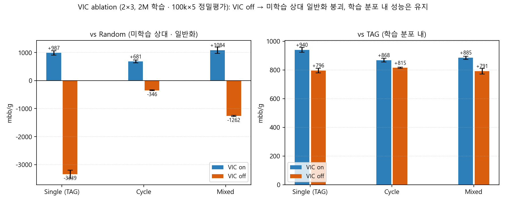

<!--
JKSCI(한국컴퓨터정보학회논문지) 양식 논문 초안
- 영문: 제목 / Abstract / Key words / REFERENCES
- 국문: 요약 / 주제어 / 본문(I~IV)
- 변환: pandoc 논문초안_JKSCI.md -o 논문초안_JKSCI.docx
- 주의: 모든 수치는 실측(28번 VIC ablation 100k×5, 2026-06-15). 강한 단정("최초/유일/완벽 증명") 금지.
-->

# Virtual Information Cost: Releasing a Zero-Cost Absorbing Trap Is a Necessary Condition for Distributional Generalization in Tabular Reinforcement Learning for Imperfect-Information Games

**가상 정보비용(VIC): 불완전정보 게임의 테이블형 강화학습에서 영-비용 흡수 현상의 해제는 분포 일반화의 필요조건이다**

---

## [Abstract]

Widening the distribution of training opponents is a common remedy for overfitting in games, but *why* it works is rarely isolated at the mechanism level. This paper identifies a concrete reward-shaping pathology—a *zero-cost absorbing* (ZCA) trap—and shows by controlled ablation that releasing it is a necessary condition for an opponent-diversified policy to generalize to unseen opponents. We reduce Heads-Up No-Limit Texas Hold'em to a fully transparent tabular environment of 256 decision contexts and 8 actions (2,048 cells) and learn a Q-table by on-policy Monte Carlo control with softmax exploration and proportional credit assignment. Under proportional credit, a CHECK with zero chips invested receives a structurally fixed return of zero, creating a greedy fixed point that dominates every action with a negative estimate and absorbs the policy. We propose Virtual Information Cost (VIC): charging a single virtual chip to a zero-cost CHECK, which breaks the zero fixed point at negligible economic cost. A 2×3 controlled ablation (training scheme ∈ {single, cyclic, mixed} × VIC ∈ {on, off}; the only variable changed is the one-chip virtual cost), each trained for 2 million episodes and evaluated by 100k×5 precise play, shows a decisive and consistent fingerprint: with VIC off, profit against an unseen random opponent collapses or flips sign in every scheme (single −3339.4, cyclic −346.5, mixed −1261.8 mbb/g), while profit against the in-distribution training opponent is preserved (+791 to +815 mbb/g). With VIC on, all three schemes are simultaneously profitable against both, with sign-stable lower bounds. Thus, within tabular on-policy Monte Carlo with proportional credit, opponent diversification generalizes only when the zero-cost absorbing trap is released.

▸**Key words :** Reinforcement Learning, Reward Shaping, Absorbing State, Distributional Generalization, Imperfect-Information Game, Monte Carlo Control

---

## [요 약]

학습 상대의 분포를 다양화하는 것은 게임에서 과적합을 줄이는 통상적 방법이지만, 그 효과가 발생하는 이유를 메커니즘 수준에서 분리한 연구는 드물다. 본 연구는 보상 형성(reward shaping)에서 발생하는 구조적 결함인 영-비용 흡수(zero-cost absorbing, ZCA) 현상을 규명하고, 이 현상의 해제가 상대 분포를 다양화한 정책이 미학습 상대로 일반화하기 위한 필요조건임을 통제된 ablation으로 입증한다. 헤즈업 노리밋 텍사스 홀덤을 256개 의사결정 컨텍스트와 8개 행동(2,048 셀)의 테이블형 환경으로 축소하고, on-policy 몬테카를로 제어(소프트맥스 탐색, 비례 배분 보상)로 Q-테이블을 학습한다. 비례 배분 하에서 투자액이 0인 CHECK는 구조적으로 반환값이 0으로 고정되어, 추정값이 음수인 모든 행동을 그리디 정책에서 지배하는 고정점을 형성하고 정책을 흡수한다. 본 연구는 가상 정보비용(Virtual Information Cost, VIC)을 제안한다. VIC는 투자액이 0인 CHECK에 가상의 1칩 비용을 부과하여, 무시할 만한 경제적 비용으로 이 영-고정점의 흡수성을 해소한다. 이때 $Q(s,\text{CHECK})$의 크기 자체는 0 근방에 유지되나(VIC-on에서도 0-핀 비율 약 99%), 미세한 음의 이동으로 음수 추정 행동을 그리디에서 영구 지배하던 흡수가 풀린다. 2×3 통제 ablation(학습 방식 ∈ {단일, 순환, 혼합} × VIC ∈ {on, off}, 유일한 변경은 1칩 가상비용)을 각 2백만 에피소드 학습하고 100k×5 정밀 평가로 측정한 결과는 일관된다. VIC off에서는 미학습 무작위 상대에 대한 수익이 세 방식 모두에서 붕괴하거나 부호가 반전되며(단일 −3339.4, 순환 −346.5, 혼합 −1261.8 mbb/g), 학습 분포 내 상대에 대한 수익은 유지된다(+791~+815 mbb/g). VIC on에서는 세 방식 모두 양쪽 상대에 대해 양의 수익을 보이며 부호 안정 하한도 양수이다. 즉 테이블형 on-policy 몬테카를로(비례 배분) 안에서 상대 다양화는 영-비용 흡수 현상이 해제될 때에만 일반화한다.

▸**주제어 :** 강화학습, 보상 형성, 흡수 상태, 분포 일반화, 불완전정보 게임, 몬테카를로 제어

---

## I. Introduction

게임 환경에서 강화학습 에이전트의 과적합을 줄이기 위한 표준적 방법은 학습 상대의 분포를 다양화하는 것이다. 도메인 랜덤화[5]와 리그 기반 셀프플레이[6]가 대표적이며, 본 연구의 예비 실험에서도 학습 상대를 순환 및 혼합하였을 때 여러 상대에 대한 강건한 수익이 회복되었다. 그러나 이러한 방법은 다양화가 효과를 내는 이유와 그 효과가 항상 성립하는지를 메커니즘 수준에서 분리하여 설명하지 못한다. 본 논문에서는 다양화가 일반화로 이어지기 위하여 반드시 충족되어야 하는 구조적 전제를 규명하고, 이를 통제된 ablation으로 인과적으로 분리한다.

이 전제는 보상 형성(reward shaping)에 내재한다. 비례 배분 보상(proportional credit assignment)을 사용하는 on-policy 몬테카를로 제어에서, 투자액이 0인 CHECK 행동은 구조적으로 반환값 $G_t=0$을 가진다. 이 0은 추정값이 음수인 모든 행동을 그리디 정책에서 지배하는 흡수 고정점을 형성한다. 본 논문에서는 이를 영-비용 흡수(zero-cost absorbing, ZCA) 현상으로 정의한다. ZCA에 노출된 정책은 학습에 필요한 공격적 행동을 회피하도록 흡수되며, 그 결과 학습 분포 내 상대에게는 양의 수익을 유지하면서도 미학습 상대로의 일반화에는 선택적으로 실패한다.

이 현상을 정확히 관측하기 위해서는 함수근사 오차를 배제할 수 있는 통제 환경이 필요하다. 신경망을 사용할 경우 일반화 실패가 함수근사 오차에서 비롯된 것인지 보상 형성 구조에서 비롯된 것인지 분리할 수 없기 때문이다. 따라서 본 연구에서는 헤즈업 노리밋 텍사스 홀덤(Heads-Up No-Limit Texas Hold'em, HUNL)을 256개 컨텍스트(2,048 셀)의 순수 테이블형(tabular) 환경으로 축소한다.

본 논문에서는 해법으로 가상 정보비용(Virtual Information Cost, VIC)을 제안한다. VIC는 투자액이 0인 CHECK에 가상의 1칩 비용을 부과하여 반환값 $G_t$의 영-고정점이 갖는 흡수성(음수 추정 행동에 대한 그리디 지배)을 해소하는 최소 개입으로, 경제적 비용은 무시할 만한 수준이다. 본 논문이 답하고자 하는 연구 질문은 다음과 같다. (RQ1) 단일 상대에게 얻은 수익은 일반적 실력인가, 해당 상대에 대한 과적합인가? (RQ2) 학습량·탐색·커버리지를 확대하는 통상적 방법으로 과적합이 해소되는가? (RQ3) 상대 분포의 다양화가 미학습 상대로 일반화하기 위하여 ZCA의 해제(VIC)가 필요한가?

본 논문의 기여는 다음과 같다. 첫째, 비례 배분 보상이 형성하는 ZCA 현상을 형식적으로 규명한다[1]. 둘째, 단일 상대 과적합과 통상적 방법 3종(학습량·탐색·커버리지)의 무효를 측정으로 제시하여, 병목이 학습자 측 탐색·커버리지가 아니라 전이·보상 구조에 있음을 좁힌다. 셋째, 2×3 통제 ablation을 통하여 VIC가 분포 일반화의 필요조건임을 인과적으로 분리한다. 즉 VIC가 없으면 어떠한 상대 분포 다양화(단일·순환·혼합)도 미학습 상대로 일반화하지 못하는 반면, 학습 분포 내 성능은 유지됨을 보인다. 본 논문의 구성은 다음과 같다. II장에서는 관련 연구와 실험 설정을 기술하고, III장에서는 제안 기법과 ablation 결과를 제시하며, IV장에서 결론을 맺는다.

## II. Preliminaries

### 1. Related works

#### 1.1 보상 형성과 흡수 상태

on-policy 방법의 수렴은 무한 탐색 하의 그리디 수렴(GLIE) 조건으로 정리되어 있으며[2], 몬테카를로 제어와 시간차 학습의 편향-분산 트레이드오프는 표준 교과서에 정리되어 있다[1]. 보상 형성은 도메인 지식을 주입하여 학습을 가속하는 기법이지만, 임의의 보상 변형은 최적 정책을 변경할 수 있으며 잠재함수 기반 보상 형성(potential-based reward shaping)만이 정책 불변성을 보장한다는 점이 알려져 있다[9]. 본 연구가 사용하는 비례 배분 보상은 잠재함수 기반 변형이 아니므로, 정책 불변성이 보장되지 않는 구간에 해당한다. 한편 보상 라벨이 0이거나 부호가 반대인 경우에도 에이전트가 특정 보수적 행동으로 수렴하는 편향이 보고된 바 있다[10]. 다만 이러한 편향은 데이터 커버리지에서 비롯되는 것으로 설명되며, 비례 배분 보상에서 투자액이 0인 행동이 학습으로 소거되지 않는 영구적 고정점을 형성하여 일반화를 선택적으로 차단하는 현상은 본 연구가 규명하는 지점이다.

#### 1.2 분포 다양화와 포커

학습 분포를 확장하여 과적합을 줄이는 전략은 도메인 랜덤화[5]와 리그 기반 셀프플레이[6]에서 경험적으로 활용되어 왔다. 그러나 이들은 다양화의 효과를 경험적으로 보고하는 데 머물며, 다양화가 일반화로 이어지기 위한 전제 조건을 보상 형성 수준에서 분리하지는 않는다. 근사 및 오프라인 강화학습의 커버리지/집중성(concentrability) 이론은 행동 정책이 커버리지를 통제한다고 전제한다[3][4]. 포커 분야에서는 초인적 에이전트[7]와 부분관측 다중에이전트 정책 최적화[8]가 보고되었으나, 이들은 착취(exploitation)와 수렴에 초점을 두며 보상 형성이 일반화에 미치는 인과를 통제된 ablation으로 분리하지는 않는다. 순수 테이블형·비례 배분 보상에서 영-비용 흡수 현상이 분포 일반화를 선택적으로 차단하고 1칩 가상비용의 해제가 그 필요조건이 되는 조합은, 저자가 아는 한 보고된 바 없다.

### 2. Experimental Setup

**환경.** HUNL, 시작 스택 200, SB(Small Blind)=1 / BB(Big Blind)=2, `pokerkit` 엔진을 사용한다. 상태 추상화는 Round(4) × Position(2) × HandBucket(8) × PrevAction(4) = 256 컨텍스트이며, 행동은 FOLD / CHECK / CALL / RAISE_25 / RAISE_50 / RAISE_75 / RAISE_100 / RAISE_ALLIN의 8종이다. 따라서 테이블 크기는 256 × 8 = 2,048 셀이다. 상대는 학습하지 않는 고정 규칙 기반 페르소나 5종(TAG, LAG, MAN, STA, NIT)으로, 환경 전이 $P(s'\mid s,a)$의 일부로 흡수된다(고정-상대 단일 에이전트 MDP).

**알고리즘.** Q-table을 on-policy 몬테카를로로 갱신한다($Q(s,a) \leftarrow Q(s,a) + \alpha\,(G_t - Q(s,a))$, 부트스트랩 없음). 기여도 배분은 비례 배분(proportional credit)을 사용한다: 한 핸드의 페이오프 $R$을 각 행동의 투자액 비중 $\mathrm{inv}/\sum \mathrm{inv}$로 나누어 반환값을 구성한다($G_t = (\mathrm{inv}/\sum\mathrm{inv})\,R$). 탐색은 소프트맥스(온도 $T$: 10.0 → 0.5, 학습 전반 80% 구간 선형 감쇠)를 사용하며, $\alpha=0.1$, $\gamma=0.9$, seed 42로 고정한다. 평가는 raw-greedy(어댑터 OFF), 100k 핸드 × 다중 seed로 수행하며 학습과 평가를 분리한다.

**영-비용 흡수(ZCA)와 가상 정보비용(VIC).** 비례 배분 하에서 투자액 $\mathrm{inv}=0$인 CHECK는 기여도 비중이 0이 되어 반환값이 구조적으로 $G_t=0$으로 고정된다. 따라서 $Q(s,\text{CHECK})$은 0으로 수렴하고, 추정값이 음수인 모든 행동(예: 손실 위험이 있는 RAISE/CALL)을 그리디 정책에서 지배한다. 이 영-고정점은 흡수 상태처럼 작동하여 정책을 보수적 행동으로 흡수한다(ZCA 현상). 여기서 ZCA는 Q-값을 0으로 초기화한 데서 비롯되는 일시적 편향과 구별된다. 초기화 편향은 경험이 누적되면 소거되지만, 비례 배분에서 CHECK의 반환값은 매 에피소드 구조적으로 0으로 재고정되므로 학습량과 탐색을 확대하여도 소거되지 않는다(III장 1절에서 측정으로 확인한다). VIC는 $\mathrm{inv}=0$인 CHECK에 가상의 1칩 투자액을 부여하여($\mathrm{inv}\leftarrow 1$) CHECK의 기여도 비중을 정확한 0에서 미세하게 분리한다. 이때 $Q(s,\text{CHECK})$의 크기 자체는 0 근방에 머물지만(VIC-on에서도 0-핀 비율 약 99%, III장 1절), 그 값이 미세한 음으로 이동하여 음수 추정 행동을 그리디에서 영구 지배하던 흡수가 해소된다(흡수 비율 측정값 약 25%→8%). 반면 아직 방문하지 않은(진정한 미학습) 행동의 0은 그대로 보존되어 낙관적 초기화에 의한 탐색이 유지된다. 즉 VIC는 *학습 후에도 재고정되는 CHECK의 0*(흡수성 0)만 미세 음으로 풀고 *미학습 행동의 0*(탐색 가치 0)은 건드리지 않는다. 1칩은 시작 스택 200·BB 2 대비 무시할 만한 경제적 크기이므로, VIC는 보상의 척도를 실질적으로 변경하지 않으면서 흡수만 해소하는 최소 개입이다. 본 연구의 ablation에서 변경되는 변수는 이 1칩 가상비용의 on/off뿐이다.

**평가 지표.** mbb/g(milli-big-blinds per game = 평균 × 500). 회차 표준편차(회차SD)는 서로 다른 seed로 독립 평가한 회차 간 표준편차이다. vs Random은 미학습(분포 밖) 상대, vs fixed TAG는 학습 분포 내 상대에 대한 성능으로, 두 지표의 분리가 일반화와 분포 내 적합을 구분한다.

| Item | Value |
|---|---|
| State contexts | 256 (Round 4 × Pos 2 × Bucket 8 × PrevAct 4) |
| Actions | 8 (FOLD…RAISE_ALLIN) |
| Q-table cells | 2,048 |
| Credit assignment | proportional ($G_t=(\mathrm{inv}/\sum\mathrm{inv})R$) |
| VIC (virtual cost of zero-invest CHECK) | 1 chip (on) / 0 chip (off) |
| $\alpha$, $\gamma$, seed | 0.1, 0.9, 42 |
| Temperature schedule | 10.0 → 0.5 (linear, first 80%) |

**Table 1. Experimental Configuration**

## III. The Proposed Scheme

### 1. 단일 상대 과적합과 통상적 방법의 한계 (배경)

단일 상대로 학습한 정책은 그 상대에 과적합된다. 26a(LAG 단일)의 vs Random 성능은 −563.0 mbb/g, 26c(STA 단일)는 −674.5 mbb/g로, 학습에 사용하지 않은 상대에 대해서는 손실을 기록하였다(수치는 Table 2와 동일한 100k×5 정밀평가 기준). 같은 정책이 학습 상대인 고정 TAG에게는 각각 +932.6, +778.0 mbb/g의 큰 수익을 보이므로, 이 수익은 일반적 실력이 아니라 특정 상대에 대한 과적합이다. 과적합을 해소하려는 통상적 방법 3종도 본 환경에서는 무효였다. (i) 예산 증가: 도달확률 0인 셀이 45.5%로 구조적으로 존재해 무한 예산으로도 채워지지 않는다. (ii) 탐색 강화: 온도를 네 방향으로 조정하여도 미학습 컨텍스트 수가 거의 불변(67 → 68/71/72)이다. (iii) 커버리지 확장: 수익을 내는 정책이 baseline보다 더 넓은 커버리지를 갖지 않는다. 즉 병목은 학습자 측 탐색·커버리지가 아니라 전이·보상 구조에 있다. 이러한 결과는 ZCA가 초기화에서 비롯되는 일시적 편향이 아니라 전이·보상 구조에서 비롯되는 영구적 현상임을 뒷받침한다.

학습 상대 분포를 다양화하면(순환·혼합) 미학습 상대에 대한 수익이 회복되어, 다양화가 일반화의 유효한 요인임이 확인된다. 그러나 다양화가 일반화로 이어지는 데 어떤 구조적 전제가 필요한지는 다양화 자체로는 드러나지 않는다. 이를 인과적으로 분리한 것이 다음의 VIC ablation이다.

### 2. VIC ablation — 영-비용 흡수 해제는 분포 일반화의 필요조건

학습 알고리즘·하이퍼파라미터·seed·상대풀·평가를 모두 고정하고 1칩 가상비용(VIC)의 on/off만 변경하는 2×3 통제 ablation을 수행하였다. 학습 방식은 single(TAG 단일)·cycle(5종 균등 순환)·mixed(LAG·STA 가중 혼합)의 3종이며, 각 조건을 2M 에피소드 학습 후 100k×5 정밀 평가로 측정하였다(raw-greedy). 결과는 Table 2와 Fig. 2에 정리한다.

| Scheme | VIC | vs Random (mbb/g, SD) | vs fixed TAG (mbb/g, SD) | vs Random −3SD | Verdict |
|---|---|---|---|---|---|
| Single (TAG) | **on** | **+987.1 (76.7)** | +940.4 (16.5) | +757.0 | profit on both |
| Single (TAG) | off | **−3339.4 (143.8)** | +795.9 (15.8) | −3770.8 | fail vs Random |
| Cycle | **on** | **+681.3 (51.4)** | +868.3 (12.1) | +527.1 | profit on both |
| Cycle | off | **−346.5 (17.8)** | +814.8 (4.4) | −399.9 | fail vs Random |
| Mixed | **on** | **+1083.9 (110.5)** | +885.2 (10.9) | +752.4 | profit on both |
| Mixed | off | **−1261.8 (22.5)** | +791.2 (20.3) | −1329.3 | fail vs Random |

**Table 2. VIC Ablation (2×3, 2M episodes, raw-greedy 100k×5)**

**Fig. 2. VIC Ablation: With VIC off, generalization to an unseen (Random) opponent collapses in every scheme, while in-distribution (vs TAG) performance is preserved. Error bars = round-to-round SD.**

세 방식에서 동일한 결과 양상이 관측되었다. VIC off에서는 미학습 상대(vs Random) 성능이 세 방식 모두에서 붕괴하였다. single은 +987.1에서 −3339.4로 Δ−4326을 보였고, cycle과 mixed는 부호가 반전되었다(+681.3→−346.5, +1083.9→−1261.8). 반면 학습 분포 내 성능(vs fixed TAG)은 off에서도 +791.2~+814.8로 유지되었다. 즉 ZCA 흡수는 모든 학습을 손상시키는 것이 아니라 미학습 상대로의 일반화만 선택적으로 차단한다. 이 선택성은 VIC가 일반화의 필요조건임을 가리키는 직접적 근거이다. 부호 안정성도 명확하게 나타난다. VIC on의 세 방식은 vs Random의 평균−3·회차SD 하한이 모두 양수(+527.1~+757.0)이고, VIC off는 모두 음수(−399.9~−3770.8)로, on/off 간 부호 분리가 잡음 범위를 넘어선다.

### 3. 평가 표본 크기의 영향 (방법론적 주의)

본 ablation의 신호는 평가 표본 크기에 민감하다. 학습 루프 내 약식 평가(국당 200게임)는 회차SD가 ±1500~2700에 달해 on/off 차이를 덮어버렸고, 일부 조건에서는 부호까지 뒤집혀 보였다(mixed_on이 약식에서 −1510으로 관측되었으나 정밀평가에서 +1083.9). 결정적 분리는 100k×5 정밀평가(회차SD ±18~144)에서만 나타났다. 따라서 본 연구의 모든 결론 수치는 정밀평가에 근거하며, 약식 평가는 진단 용도로만 사용한다. 이는 인과 ablation에서 평가 표본 크기가 결론을 좌우할 수 있다는 일반적 교훈이기도 하다.

### 4. 핵심 명제 (조건부)

> 테이블형 on-policy 몬테카를로 제어(비례 배분 보상) 안에서, 상대 분포의 다양화는 영-비용 흡수(ZCA) 현상이 해제될 때에만 미학습 상대로 일반화한다. 1칩 가상비용(VIC)에 의한 ZCA 해제는 이 일반화의 필요조건이다.

본 명제는 (i) 비례 배분 보상, (ii) 영-비용 행동(투자 0의 CHECK)의 존재, (iii) 테이블형 on-policy MC라는 세 조건 하의 조건부 명제이다. 필요성은 2×3 ablation의 일관된 부호 분리로 뒷받침되며, 충분성(VIC만으로 임의 상대에 일반화)이나 함수근사·CFR 계열로의 확장은 미검증 요인으로 후속 과제에 남긴다. 본 연구는 VIC가 일반화를 위한 유일한 해법이라는 강한 주장은 하지 않는다.

## IV. Conclusions

본 연구는 게임에서 학습 상대 분포의 다양화가 일반화로 이어지는 전제를 보상 형성 수준에서 규명하였다. 비례 배분 보상을 사용하는 테이블형 on-policy 몬테카를로 제어에서, 투자액 0의 CHECK가 형성하는 영-비용 흡수(ZCA) 현상이 미학습 상대로의 일반화를 선택적으로 차단함을 보이고, 1칩 가상비용(VIC)으로 이 현상을 해제하는 최소 개입을 제안하였다. 2×3 통제 ablation(방식 3종 × VIC on/off, 유일 변경=1칩 가상비용, 각 2M·100k×5 정밀평가)에서, VIC를 끄면 세 방식 모두 미학습 상대(vs Random)에 대한 수익이 붕괴하거나 부호가 반전되는 반면 학습 분포 내(vs TAG) 성능은 유지되었다. 이 일관된 선택적 붕괴는 VIC가 분포 일반화의 필요조건임을 인과적으로 분리한 증거이다. 함수근사 오차가 배제된 256셀 환경에서 얻은 결과이므로 결론을 보상 형성 구조에 귀속할 수 있다. 본 연구는 분포 다양화 방법을 반박하지 않으며, 신규성은 새로운 정리가 아니라 해당 방법의 숨은 전제(영-비용 흡수의 해제)를 통제된 ablation으로 드러낸 데 있다. 방법론적으로는 약식 평가(국당 200게임)가 신호를 덮어, 인과 ablation에서 평가 표본 크기가 결론을 좌우할 수 있음을 함께 기록한다. 후속 과제로 VIC 충분성의 검증, 가상비용 크기·기여도 배분 방식의 변화에 따른 분석, 함수근사·CFR·셀프플레이로의 일반화, 그리고 상대도 학습하는 멀티에이전트로의 확장을 남긴다.

## ACKNOWLEDGEMENT

This work was conducted as an independent undergraduate research project. (필요 시 지도교수·기관·연구비 정보를 기재)

## REFERENCES

[1] R. S. Sutton and A. G. Barto, "Reinforcement Learning: An Introduction," 2nd ed., MIT Press, Cambridge, MA, 2018.

[2] S. Singh, T. Jaakkola, M. L. Littman, and C. Szepesvári, "Convergence Results for Single-Step On-Policy Reinforcement-Learning Algorithms," Machine Learning, Vol. 38, No. 3, pp. 287-308, March 2000. DOI: 10.1023/A:1007678930559

[3] R. Munos, "Performance Bounds in Lp-norm for Approximate Value Iteration," SIAM Journal on Control and Optimization, Vol. 46, No. 2, pp. 541-561, 2007. DOI: 10.1137/040614384

[4] J. Chen and N. Jiang, "Information-Theoretic Considerations in Batch Reinforcement Learning," Proceedings of the 36th International Conference on Machine Learning (ICML), pp. 1042-1051, 2019.

[5] J. Tobin, R. Fong, A. Ray, J. Schneider, W. Zaremba, and P. Abbeel, "Domain Randomization for Transferring Deep Neural Networks from Simulation to the Real World," Proceedings of the IEEE/RSJ International Conference on Intelligent Robots and Systems (IROS), pp. 23-30, 2017. DOI: 10.1109/IROS.2017.8202133

[6] O. Vinyals, I. Babuschkin, W. M. Czarnecki, et al., "Grandmaster Level in StarCraft II Using Multi-Agent Reinforcement Learning," Nature, Vol. 575, pp. 350-354, 2019. DOI: 10.1038/s41586-019-1724-z

[7] N. Brown and T. Sandholm, "Superhuman AI for Heads-Up No-Limit Poker: Libratus Beats Top Professionals," Science, Vol. 359, No. 6374, pp. 418-424, 2018. DOI: 10.1126/science.aao1733

[8] S. Srinivasan, M. Lanctot, V. Zambaldi, J. Pérolat, K. Tuyls, R. Munos, and M. Bowling, "Actor-Critic Policy Optimization in Partially Observable Multiagent Environments," Advances in Neural Information Processing Systems (NeurIPS), Vol. 31, pp. 3422-3435, 2018.

[9] A. Y. Ng, D. Harada, and S. Russell, "Policy Invariance under Reward Transformations: Theory and Application to Reward Shaping," Proceedings of the 16th International Conference on Machine Learning (ICML), pp. 278-287, 1999.

[10] A. Li, D. Misra, A. Kolobov, and C.-A. Cheng, "Survival Instinct in Offline Reinforcement Learning," Advances in Neural Information Processing Systems (NeurIPS), Vol. 36, pp. 79759-79783, 2023.
