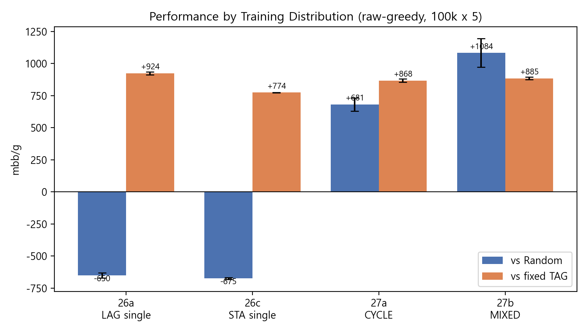
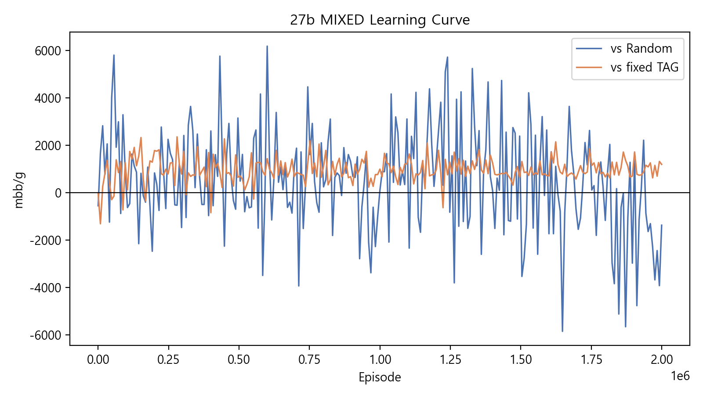

<!--
JKSCI(한국컴퓨터정보학회논문지) 양식 논문 초안
- 영문: 제목 / Abstract / Key words / REFERENCES
- 국문: 요약 / 주제어 / 본문(I~IV)
- 변환: pandoc 논문초안_JKSCI.md -o 논문초안_JKSCI.docx
- 주의: 모든 수치는 실측(2026-06-03). 강한 단정("최초/유일/완벽 증명") 금지.
-->

# Coverage Is Not Performance: Opponent-Induced Limits on State Reachability in Tabular Reinforcement Learning for Imperfect-Information Games

**커버리지는 성능이 아니다: 불완전정보 게임의 테이블형 강화학습에서 상대가 유발하는 상태 도달성의 한계**

---

## [Abstract]

This paper asks whether the failure of the simplest reinforcement learning (RL) in a high-variance imperfect-information game is a matter of insufficient tuning or a structural property of the environment, and it isolates the latter through exact measurement. We reduce Heads-Up No-Limit Texas Hold'em to a fully transparent tabular environment of 256 decision contexts and 8 actions (2,048 cells) and learn a Q-table by on-policy Monte Carlo control with softmax exploration. Because function-approximation error is eliminated, the state-visitation distribution can be measured exactly at the cell level. We first confirm by direct measurement that a policy trained against a single opponent overfits to it, losing against a random opponent. We then reject, one by one, the three conventional remedies for such overfitting—enlarging the training budget, strengthening exploration, and widening coverage: 45.5% of cells are structurally unreachable, a four-condition temperature sweep leaves the reach set almost unchanged, and profitable policies do not have broader coverage. Coverage, in short, is not performance. Finally, we show that diversifying the distribution of training opponents (cyclic and probabilistic mixtures of personas) restores robust profitability across opponents, validated by 2-million-episode experiments. Among the levers we tested, only the transition distribution induced by the opponent moved the attainable performance.

▸**Key words :** Reinforcement Learning, State Coverage, Reachability, Imperfect-Information Game, Distributional Robustness, Monte Carlo Control

---

## [요 약]

본 연구는 가장 단순한 강화학습이 분산이 크고 정보가 불완전한 게임에서 보이는 실패가 단순한 튜닝 부족인지, 아니면 환경 자체의 구조적 성질인지를 묻고, 함수근사 오차가 배제된 통제 환경에서 후자를 분리해 보인다. 헤즈업 노리밋 텍사스 홀덤을 256개 의사결정 컨텍스트와 8개 행동(2,048 셀)의 완전 투명한 테이블형 환경으로 축소하고, on-policy 몬테카를로 제어로 Q-테이블을 학습하여 상태 도달 분포를 셀 단위로 전수 측정하였다. 먼저 단일 상대로 학습한 정책이 그 상대에 과적합되어 무작위 상대에게는 적자임을 직접 측정으로 확인하였다. 이어 과적합을 깨기 위한 통념적 처방 3종(학습량 증가·탐색 강화·커버리지 확장)을 차례로 기각하였다. 도달확률 0인 셀이 45.5%로 구조적으로 존재하고, 온도를 네 방향으로 스윕해도 도달 분포가 거의 바뀌지 않으며, 흑자 정책이 더 넓은 커버리지를 갖지도 않았다. 즉 커버리지는 곧 성능이 아니다. 마지막으로 학습 상대의 분포를 다양화하면 여러 상대에 걸친 강건한 흑자가 회복됨을 2백만 에피소드 규모 실험으로 검증하였다. 우리가 시험한 레버 중에서는 상대가 만드는 전이 분포만이 달성 가능한 성능을 움직였다.

▸**주제어 :** 강화학습, 상태 커버리지, 도달성, 불완전정보 게임, 분포 강건성, 몬테카를로 제어

---

## I. Introduction

현대 강화학습(Reinforcement Learning, RL)에서 탐색이 실패하면 그 원인은 보통 학습자 측 결함—알고리즘의 한계, 데이터 커버리지 부족, 신경망 함수근사의 오차—으로 귀속되고, 개선의 초점도 그곳에 맞춰진다. 그러나 상대의 은닉된 의사결정이 상태 전이를 좌우하는 불완전정보 게임에서는, 환경(상대) 자체가 특정 상태로의 경로를 닫아버려 학습자가 탐색을 아무리 강화해도 그 상태에 도달하지 못하는 상황이 발생할 수 있다.

이 현상을 깨끗이 관측하려면 "근사 오차라는 변명"이 불가능한 통제 환경이 필요하다. 신경망을 사용하면 도달 실패가 일반화 실패인지 환경에 의한 차단인지 분리할 수 없기 때문이다. 따라서 본 연구는 거대한 헤즈업 노리밋 텍사스 홀덤(Heads-Up No-Limit Texas Hold'em, HUNL)을 256개 컨텍스트(2,048 셀)의 순수 테이블형(tabular) 환경으로 축소하고, 상태 도달 분포 $d^{\pi}(s)$를 셀 단위로 전수(exact) 측정한다.

본 연구의 가치는 고정된 규칙 기반 상대를 이기는 결과 자체가 아니라, 단순 RL의 한계가 어디서 오는지를 측정으로 분리하고 그 처방을 실증하는 데 있다. 본 논문은 다음 연구 질문에 답한다. (RQ1) 단일 상대에게 얻은 흑자는 일반적 실력인가, 그 상대에 대한 과적합인가? (RQ2) 과적합이라면, 학습량·탐색·커버리지를 키우는 통념적 처방으로 해소되는가? (RQ3) 그렇지 않다면 무엇이 달성 가능한 성능을 좌우하는가? 본 연구의 기여는 다음과 같다[3][4]. 첫째, 단일 상대 학습이 과적합임을 셀 단위 측정으로 정량 확증한다. 둘째, 과적합을 깨기 위한 통념적 처방 3종(학습량·탐색·커버리지)이 모두 무효임을 직접 측정으로 기각하여 "커버리지는 곧 성능이 아니다"를 보인다. 셋째, 학습 상대 분포의 다양화가 여러 상대에 걸친 강건한 흑자를 회복함을 대규모 실험으로 실증한다.

## II. Preliminaries

### 1. Related works

#### 1.1 탐색·과적합과 분포 다양화 (영문 작성 권장)

on-policy 방법의 수렴은 무한 탐색 하의 그리디 수렴(GLIE) 조건으로 정리되어 있으며[2], 몬테카를로와 시간차 학습의 편향-분산 트레이드오프도 표준 교과서의 내용이다[1]. 한편 학습 분포를 넓혀 과적합을 줄이는 전략은 도메인 랜덤화[5]와 리그·셰프플레이[6]에서 경험적으로 활용되어 왔다. 그러나 이들은 "다양화하면 좋더라"는 경험적 처방에 머물르며, 어떤 메커니즘으로 효과가 생기는지를 도달확률 수준에서 분해하지는 않는다.

#### 1.2 커버리지·집중성 이론과 포커 (영문 작성 권장)

근사·오프라인 RL의 커버리지/집중성(concentrability) 이론은 행동 정책(학습자)이 커버리지를 통제한다고 전제한다[3][4]. 포커 분야에서는 초인적 에이전트[7]와 부분관측 다중에이전트 정책 최적화[8]가 보고되었으나, 이들은 착취(exploitation)와 수렴에 초점을 맞추며 셀 단위 커버리지 한계 자체를 측정하지는 않는다. 본 연구가 측정하는 "단일 에이전트·순수 테이블형·고정 상대가 외생적으로 결정하는 상태 도달성의 한계"라는 조합은, 저자가 아는 한(to our knowledge) 보고된 바 없다.

### 2. Experimental Setup

**환경.** HUNL, 시작 스택 200, SB(Small Blind)=1 / BB(Big Blind)=2, `pokerkit` 엔진을 사용한다. 상태 추상화는 Round(4) × Position(2) × HandBucket(8) × PrevAction(4) = 256 컨텍스트이며, 행동은 FOLD / CHECK / CALL / RAISE_25 / RAISE_50 / RAISE_75 / RAISE_100 / RAISE_ALLIN의 8종이다. 따라서 테이블 크기는 256 × 8 = 2,048 셀이다. 상대는 학습하지 않는 고정 규칙 기반 페르소나 5종(TAG, LAG, MAN, STA, NIT)으로, 환경 전이 $P(s'\mid s,a)$의 일부로 흡수된다(고정-상대 단일 에이전트 MDP).

**알고리즘.** Q-table을 on-policy 몬테카를로로 갱신한다($Q(s,a) \leftarrow Q(s,a) + \alpha\,(G_t - Q(s,a))$, 부트스트랩 없음). 탐색은 소프트맥스(온도 $T$: 10.0 → 0.5, 학습 전반 80% 구간 선형 감쇠)를 사용하며, $\alpha=0.1$, $\gamma=0.9$, seed 42로 고정한다. 평가는 raw-greedy(어댑터 OFF), 100k 핸드 × 다중 seed로 수행하며 학습과 평가를 분리한다.

**평가 지표.** mbb/g(milli-big-blinds per game = 평균 × 500). 회차 표준편차(회차SD)는 서로 다른 seed로 독립 평가한 회차 간 표준편차이다.

| Item | Value |
|---|---|
| State contexts | 256 (Round 4 × Pos 2 × Bucket 8 × PrevAct 4) |
| Actions | 8 (FOLD…RAISE_ALLIN) |
| Q-table cells | 2,048 |
| $\alpha$, $\gamma$, seed | 0.1, 0.9, 42 |
| Temperature schedule | 10.0 → 0.5 (linear, first 80%) |

**Table 1. Experimental Configuration**

## III. The Proposed Scheme

### 1. 단일 상대 과적합의 정량 확증

단일 상대로 학습한 정책은 그 상대에 과적합된다. 26a(LAG 단일)의 vs Random 성능은 −650.4 mbb/g(회차SD 19.3), 26c(STA 단일)는 −674.9 mbb/g(회차SD 6.5)로, 학습에 쓰지 않은 상대 앞에서는 적자였다. 같은 정책이 학습 상대인 고정 TAG에게는 각각 +924.4, +774.3 mbb/g의 큰 흑자를 내므로(Table 2), 이 흑자는 일반적 실력이 아니라 특정 상대에 대한 과적합이다. 이로써 "약한 베이스라인을 착취한 흑자"라는 시비는 "그 흑자가 과적합임을 정량 입증한" 연구 주제로 흡수된다.

### 2. 통념적 처방 3종의 반증 — 커버리지는 성능이 아니다

과적합을 깨려는 사람이 가장 먼저 시도할 세 가설을 차례로 데이터로 기각하였다.

- **6-A (예산 증가):** 미학습 셀은 에피소드 부족 때문이라는 가설. 측정 결과 도달확률 0인 셀이 45.5%이며, 테이블형·on-policy MC에서 도달확률 0 셀이 갱신되지 않는 것은 버그가 아니라 정상 성질이다. 예산을 무한히 늘려도 채워지지 않는다.
- **6-B (탐색 강화):** 온도를 높이면 빈 셀이 채워진다는 가설. 온도를 네 방향으로 스윕(시작 10→20, 감쇠구간 0.8→0.95, 바닥 0.5→1.0)했으나 미학습 컨텍스트 수는 거의 불변(baseline 67 → 68/71/72)이고 도달 분포가 바뀌지 않았다. 온도는 이미 도달한 셀 내부의 행동 다양성만 키운다.
- **6-C (커버리지 확장):** 흑자 정책이 더 넓은 커버리지를 가진다는 가설. 게이트를 통과한 흑자 정책이 baseline보다 미학습 셀이 오히려 많은 경우가 관측되었다. 흑자의 원천은 커버리지 넓이가 아니라 학습-평가 상대 분포의 정합(상대 특화)이다.

### 3. 처방의 실증 — 학습 상대 분포의 다양화

세 처방을 기각한 뒤 다음으로 시험한 레버는 학습 상대 분포의 다양화이다(단, 가능한 유일 레버라는 주장은 아니다). 학습 알고리즘은 한 줄도 바꾸지 않고 에피소드마다 상대 페르소나만 교체하는 통제 비교(controlled comparison)를 수행하였다(각 스킴 2M 에피소드, 100k×5 평가).

| Run | vs Random (mbb/g, SD) | vs fixed TAG (mbb/g, SD) | Verdict |
|---|---|---|---|
| 26a LAG single (ref.) | −650.4 (19.3) | +924.4 (12.2) | loss vs Random |
| 26c STA single (ref.) | −674.9 (6.5) | +774.3 (1.4) | loss vs Random |
| **27a CYCLE** | **+681.3 (51.4)** | **+868.3 (12.1)** | **profit on both** |
| **27b MIXED** | **+1083.9 (110.5)** | **+885.2 (10.9)** | **profit on both** |

**Table 2. Distributional Robustness Results (raw-greedy, 100k×5)**

**Fig. 2. Performance by Training Distribution (mbb/g, error bars = SD)**

**Fig. 3. Learning Curve of the 27b MIXED Scheme**

적자였던 LAG·STA를 학습 분포에 섞자 두 스킴 모두 vs Random과 vs 고정 TAG에서 동시 흑자를 기록하여 분포 강건성을 실증하였다. 가장 빡빡한 27b의 vs Random도 부호 안정성 하한이 $1083.9 - 3 \times 110.5 = 752.4 > 0$이다. 순환(CYCLE)은 재현성을, 확률 혼합(MIXED)은 병목 직격 가중을 제공하여 "혼합 방식 임의성" 시비를 차단한다.

### 4. 핵심 명제 (조건부)

> 우리가 시험한 레버(학습량·탐색·커버리지) 중에서는, 상대가 만드는 전이 분포만이 학습 가능 영역(달성 가능한 성능의 상한)을 움직였다.

강한 버전("전이 분포가 성능 상한을 유일하게 결정한다")은 추상화 재설계·함수근사·알고리즘 교체(CFR 계열) 등 미검증 레버까지 기각해야 성립하므로 후속 과제로 남긴다. 도달확률 0 셀이 갱신되지 않는다는 명제는 테이블형·on-policy MC 한정의 조건부 명제이며, 비자명한 부분은 6-A(45.5%)·6-B(reach 불변)의 경험적 증거로 뒷받침된다.

## IV. Conclusions

본 연구는 가장 단순한 강화학습이 고분산 불완전정보 게임에서 보이는 실패가 튜닝 부족이 아니라 환경의 구조적 성질에서 비롯됨을, 함수근사 오차가 배제된 256셀 테이블형 환경에서 측정으로 분리하였다. 단일 상대 학습이 과적합임을 셀 단위로 확증하고, 과적합을 깨기 위한 통념적 처방 3종(학습량·탐색·커버리지)을 모두 측정으로 기각하여 커버리지가 곧 성능이 아님을 보였다. 나아가 학습 상대 분포의 다양화가 여러 상대에 걸친 강건한 흑자를 회복함을 2백만 에피소드 규모 실험으로 실증하였다. 기존 커버리지 이론을 반박하지 않으며, 본 연구의 신규성은 새로운 정리가 아니라 그 이론의 숨은 전제(커버리지 통제권의 귀속)를 드러내는 경계 조건의 실증적·해석적 명료화에 있다. 후속 과제로 강한 버전 명제의 검증(추상화 재설계·함수근사·CFR·리그 셰프플레이), 버킷 세분화와 ε-greedy 감쇠율 확장 스윕, 상대도 학습하는 멀티에이전트·셰프플레이로의 일반화를 남긴다.

## ACKNOWLEDGEMENT

This work was conducted as an independent undergraduate research project. (필요 시 지도교수·기관·연구비 정보를 기재)

## REFERENCES

[1] R. S. Sutton and A. G. Barto, "Reinforcement Learning: An Introduction," 2nd ed., MIT Press, Cambridge, MA, 2018.

[2] S. Singh, T. Jaakkola, M. L. Littman, and C. Szepesvári, "Convergence Results for Single-Step On-Policy Reinforcement-Learning Algorithms," Machine Learning, Vol. 38, No. 3, pp. 287-308, March 2000. DOI: 10.1023/A:1007678930559

[3] R. Munos, "Performance Bounds in Lp-norm for Approximate Value Iteration," SIAM Journal on Control and Optimization, Vol. 46, No. 2, pp. 541-561, 2007. DOI: 10.1137/040614384

[4] J. Chen and N. Jiang, "Information-Theoretic Considerations in Batch Reinforcement Learning," Proceedings of the 36th International Conference on Machine Learning (ICML), pp. 1042-1051, 2019.

[5] J. Tobin, R. Fong, A. Ray, J. Schneider, W. Zaremba, and P. Abbeel, "Domain Randomization for Transferring Deep Neural Networks from Simulation to the Real World," Proceedings of the IEEE/RSJ International Conference on Intelligent Robots and Systems (IROS), pp. 23-30, 2017. DOI: 10.1109/IROS.2017.8202133

[6] O. Vinyals, I. Babuschkin, W. M. Czarnecki, et al., "Grandmaster Level in StarCraft II Using Multi-Agent Reinforcement Learning," Nature, Vol. 575, pp. 350-354, 2019. DOI: 10.1038/s41586-019-1724-z

[7] N. Brown and T. Sandholm, "Superhuman AI for Heads-Up No-Limit Poker: Libratus Beats Top Professionals," Science, Vol. 359, No. 6374, pp. 418-424, 2018. DOI: 10.1126/science.aao1733

[8] S. Srinivasan, M. Lanctot, V. Zambaldi, J. Pérolat, K. Tuyls, R. Munos, and M. Bowling, "Actor-Critic Policy Optimization in Partially Observable Multiagent Environments," Advances in Neural Information Processing Systems (NeurIPS), Vol. 31, pp. 3422-3435, 2018.
