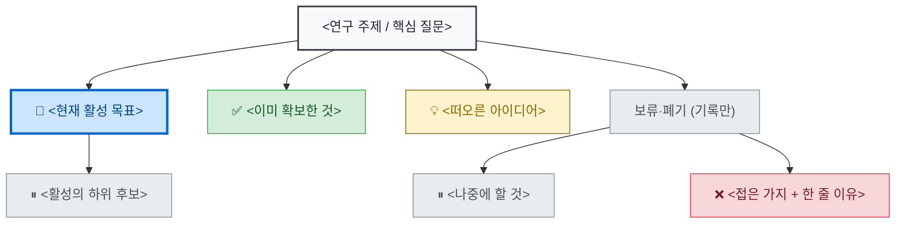

<!--
연구 트리 템플릿 — 새 연구를 시작할 때 이 파일을 프로젝트 폴더에 복사해서 쓴다.
목적: 연구 중 끝없이 생기는 옆가지를 한 트리로 관리하고 "지금 할 하나"를 잃지 않게.
시각화: GitHub 자동 렌더 · VS Code 확장 "Markdown Preview Mermaid Support"(Ctrl+Shift+V) · mermaid.live
아래 <...> 부분만 채우면 된다. ZCA 예시는 zca_theory/후속연구.md 참고.
-->

# 연구 트리 — <프로젝트명>

> **현재 활성:** <지금 진행하는 목표 하나만 적기>   ·   최종 수정: <날짜>

## 트리 (한눈에)

## 상태 범례
🔵 **활성**(지금 하나) · 💡 아이디어 · ✅ 완료 · ⏸ 보류 · ❌ 폐기(이유 보존)

## 운영 규칙 (피곤하지 않게)
1. **활성(🔵)은 항상 하나.** 매 세션 그 하나만 보고 시작, 끝나면 ✅로 바꾸고 다음 하나를 🔵로.
2. **옆가지가 떠오르면 노드만 추가**하고 💡/⏸로 재워둔다 — 지금 안 한다(흐름 안 끊기게).
3. **죽은 가지는 지우지 말고 ❌ + 한 줄 이유.** 나중에 같은 길 다시 안 가게.
4. 큰 갈래는 git 브랜치로, 지도는 이 트리로 — 두 층을 분리.

## 노드 메모 (선택, 근거·링크)
- `<노드ID>`: <결과/수치/파일 링크 한 줄>

---

### 사용법 빠른 참조
- **가지 추가**: 부모에 한 줄 → `A --> NEW["💡 라벨"]`  (화살표 = `부모 --> 자식`)
- **상태 변경**: ① 라벨 이모지(🔵✅⏸❌💡) 교체  ② 맨 아래 `class` 줄에서 그 노드ID를 해당 색 그룹으로 이동
- **보기**: GitHub는 자동 렌더 / VS Code는 확장 "Markdown Preview Mermaid Support" + `Ctrl+Shift+V` / 실시간 편집은 https://mermaid.live
